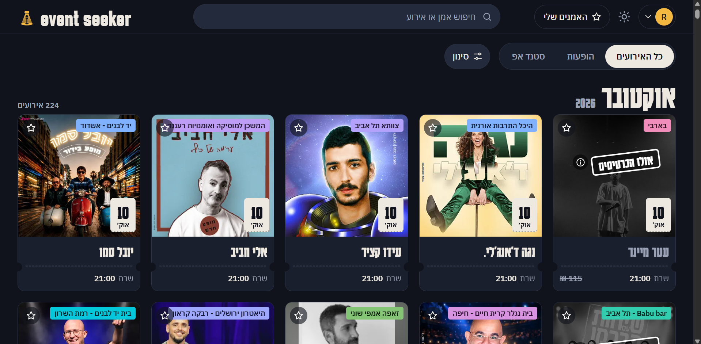
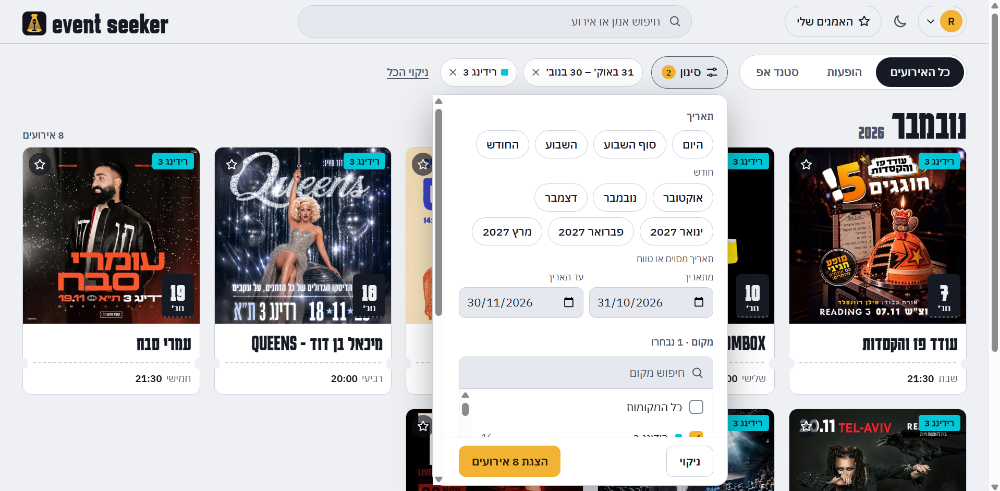
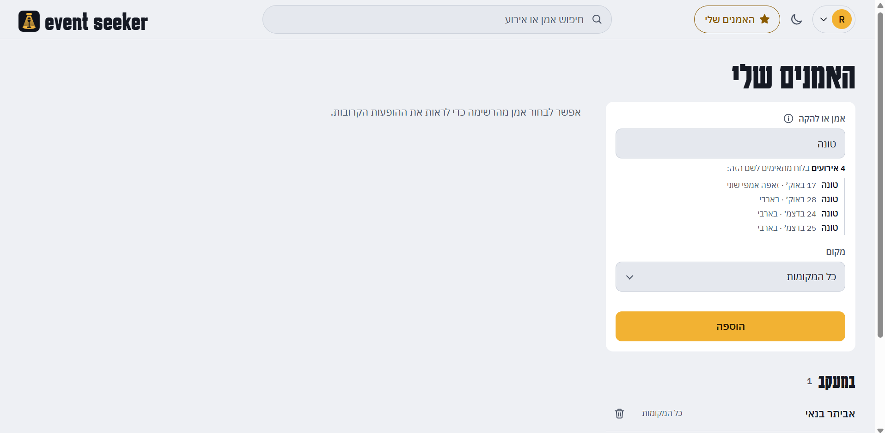
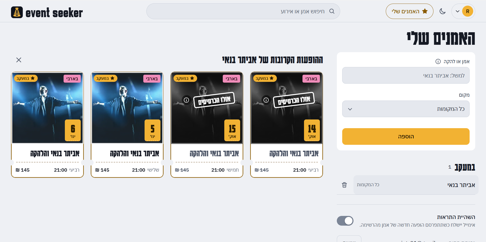
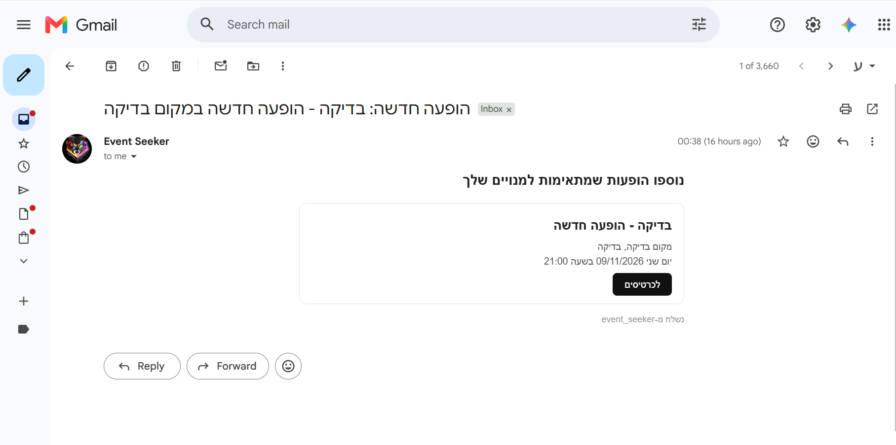
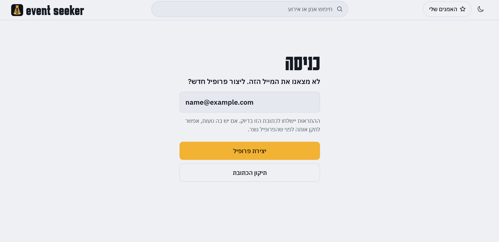
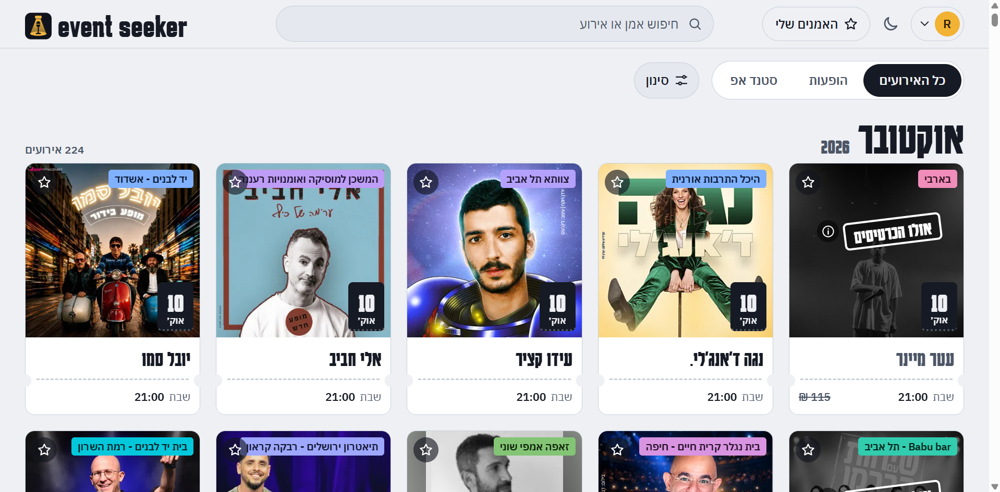
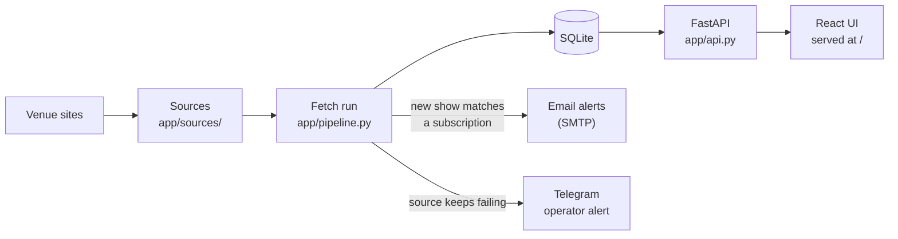
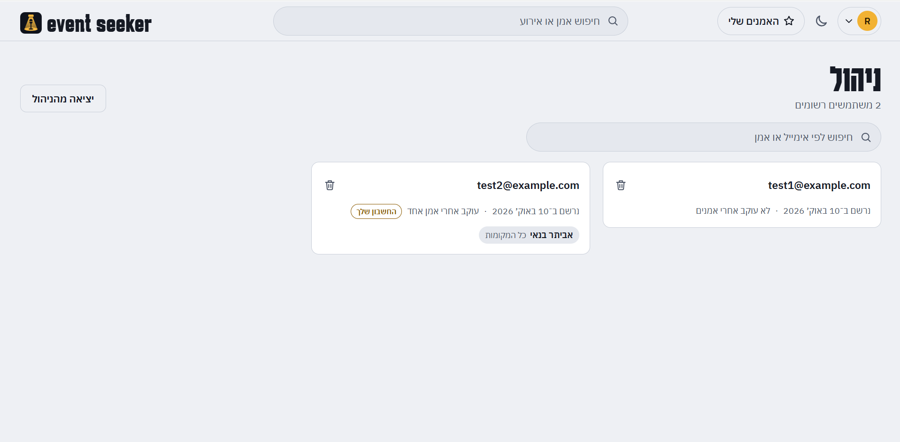

<p align="center">
  
</p>

<h1 align="center">event seeker</h1>

<p align="center">
  Live shows from Israeli venue sites on one board, and an email when an artist you follow
  announces a new one.
</p>

<p align="center">
  <a href="https://github.com/ron45700/event-seeker/actions/workflows/docker.yml"></a>
  
</p>

## What it does

event seeker collects upcoming concerts and stand-up shows from several venue sites into a
single Hebrew (right-to-left) site. You can browse and filter everything in one place, follow
the artists you care about, and get an email when a new show of theirs is published.



## Features

### Every venue on one board

Shows from Barby, Reading 3, three Zappa clubs, Kupat Tel Aviv (Menora Mivtachim Arena and Amphi
Tel Aviv) and the Comy stand-up listings, grouped by month and split into music and stand-up.
Each card shows the venue in its own colour, the date, time and price when the site gives one,
and whether tickets are sold out or unavailable (with the number of tickets left where the site
exposes it). A card opens the venue's site.

### Search and filters

Search by artist or event name, then narrow the list from a single "סינון" panel: a date
(today, this weekend, this week, this month, a specific month, or a custom date or range), any
number of venues, only the artists you follow, and hiding sold-out or unavailable shows. Active
filters appear as removable chips, and they live in the URL, so a reload or the Back button keeps
them.



### Follow artists

Follow an artist from the "האמנים שלי" page or straight from a show's card, at any venue or only
at the venues you pick. The name is matched as whole words in the event title or the guest list,
and a live preview shows which listed events it matches right now.



Your followed artists are listed in one place, each with its venues and its upcoming shows. From
the same page you can pause your alerts.



### Email alerts

When a new show for a followed artist is published, you get one email per run with all the new shows:
title, venue, date, and a link to the tickets. Only shows added after a source's first sync count
as new, and alerts for shows that already took place are never sent.



### Sign-in with just an email

There is no password: the site is meant to run on a private network (it is reached over
Tailscale). A new address must be confirmed before a profile is created, so a typo does not
silently become an empty profile.



### Phone, tablet and desktop, light and dark

The layout adapts to phones, iPads and desktops. The dark and light themes are saved per account,
and both are tested for WCAG contrast.

<p>
  
</p>



## How it works



- **Sources.** Each venue site has one source class that fetches its listing (a JSON API, a
  search call or HTML pages) and converts every record into a unified `Event`. Venue names are
  cleaned on the way in, so one hall has one name everywhere.
- **The fetch run.** `serve` runs every source in the background every
  `FETCH_INTERVAL_MINUTES` (an hour by default). New events are
  stored, matched against subscriptions, and queued as alerts; the queue is sent by email when
  email is on. The first run of each source stores the existing shows as a baseline without
  sending alerts. Every run also records whether each source worked.
- **Cleanup.** Every run deletes events that are over (their end, or their start when there is
  none, more than 6 hours ago) and the cached thumbnails no stored event uses any more. A past
  show that a site still lists is not stored again, so it never comes back as a new event.
- **The site.** A FastAPI server exposes the JSON API and serves the built React UI. Cards load
  images through `/api/events/{id}/thumbnail`, which downsizes the venue image to a WebP once and
  caches it in `data/thumbs/`.

## Quick start

Requires Python 3.13 and, to build the UI, Node.js (CI and the Docker image use Node 24).

```
python -m venv .venv
.venv\Scripts\activate              # Windows; on macOS / Linux: source .venv/bin/activate
pip install -r requirements.txt

cd frontend && npm install && npm run build && cd ..   # builds the UI into web/

python -m app.main serve            # site and API on port 8765, with an hourly run in the background
```

Open `http://localhost:8765`. Interactive API docs are at `http://localhost:8765/docs`.

The server mounts `web/` only if it exists when it starts, so restart `serve` after the first
UI build.

Command line:

```
python -m app.main serve                                   # site + hourly run in the background
python -m app.main run-once                                # single fetch run
python -m app.main subscribe you@example.com "טונה"         # add a subscription
python -m app.main subscribe you@example.com "אביתר בנאי" --venue "בארבי"
python -m app.main list                                    # show subscriptions
python -m app.main inject-fake TITLE [--venue VENUE]       # add a fake event and run the alert flow
python -m app.main remove-fake                             # delete all fake events
python -m app.main test-alert                              # send a test message to the operator (Telegram)
```

Email is off by default. To turn it on, copy `.env.example` to `.env`, fill in `SMTP_USER` and
`SMTP_PASSWORD` (a Gmail App Password) and set `EMAIL_ENABLED=true`. While the switch is off,
alerts wait in the queue and are sent once it is turned on.

## Docker

Every push to `main` runs the tests and publishes an image with the built UI inside
(`.github/workflows/docker.yml`): `ghcr.io/ron45700/event-seeker:latest`, plus a `sha-...` tag
per commit. The home server runs that image from the `homelab` repo (`stacks/event-seeker/`),
so an update there is `docker compose pull && docker compose up -d`.

```
docker build -t event-seeker .
docker run -p 8765:8765 -v ./data:/app/data --env-file .env event-seeker
```

Settings come from environment variables (the same names as in `.env.example`). The database
and the thumbnail cache are in `/app/data`. The image runs in the `Asia/Jerusalem` time zone,
because event times are stored as Israel local time.

## Configuration

Settings are read from environment variables, or from a `.env` file in the project root (copy
`.env.example`; `.env` is git-ignored).

| Variable | Default | Description |
|---|---|---|
| `DB_PATH` | `data/event_seeker.db` | SQLite database. The thumbnail cache sits next to it in `thumbs/` |
| `FETCH_INTERVAL_MINUTES` | `60` | Minutes between background fetch runs |
| `HOST` | `0.0.0.0` | Address the server listens on |
| `PORT` | `8765` | Port the server listens on |
| `THUMB_WIDTH` | `480` | Width in pixels of the cached card thumbnails |
| `EMAIL_ENABLED` | `false` | Global switch for alert emails. While off, alerts wait in the queue |
| `SMTP_HOST` | `smtp.gmail.com` | SMTP server |
| `SMTP_PORT` | `587` | SMTP port |
| `SMTP_USER` | empty | Sender account |
| `SMTP_PASSWORD` | empty | A Gmail App Password, not the regular account password |
| `TELEGRAM_BOT_TOKEN` | empty | Operator alerts: the bot token from @BotFather. Leave empty to turn them off |
| `TELEGRAM_CHAT_ID` | empty | Operator alerts: the chat to message. Send the bot a message, then open `https://api.telegram.org/bot<TOKEN>/getUpdates` and take `message.chat.id` |
| `SOURCE_ALERT_AFTER_FAILURES` | `3` | Failed runs in a row before a source counts as broken |
| `ADMIN_PASSWORD` | empty | Turns on the admin panel. Empty: every `/api/admin/*` route answers 404 |
| `ADMIN_EMAIL` | empty | Optional: show the admin entry in the account menu only to this email (cosmetic) |

## Sources

| Source | Venues | How | Availability |
|---|---|---|---|
| `barby` | Barby | JSON API | sold out + tickets left |
| `reading3` | Reading 3 | HTML listing page | not exposed |
| `zappa` | Zappa Amphi Shuni, Tel Aviv, Herzliya | HTML venue pages with JSON-LD, paginated | available / not available |
| `kupat` | Menora Mivtachim Arena, Amphi Tel Aviv (Kupat Tel Aviv) | JSON API, one request per venue | sold out / available |
| `comy` | Stand-up shows nationwide (Comy) | JSON search call, one request | sold out / available |

## Adding a source

1. Add a file under `app/sources/` with a class that extends `Source` and implements
   `fetch_raw` and `parse_item`.
2. Add it to `ALL_SOURCES` in `app/sources/__init__.py`.
3. Add a sample response under `tests/fixtures/` and a test modelled on `tests/test_barby.py`.

Each event carries its own venue and city, so one source can cover several venues. For a
festival: `kind="festival"`, the lineup in `artists`, and `ends_at` for a multi-day event.

Venue names are cleaned for every source in `Source.fetch()` (`app/venues.py`): spacing,
separators, occasion notes such as "סילבסטר", and one spelling per venue. When the same hall
still shows up twice in `/api/venues` under different words, add the pair to `_ALIASES` there;
stored events and subscriptions are rewritten on the next start.

## Monitoring

Every run records, per source, whether it worked. A run that raised an error or returned no
events at all is a failure (a site that changed its markup usually parses to nothing).

| Endpoint | Answers |
|---|---|
| `/health` | 200 while the server and database work. `status` is `ok` or `degraded`, with the details of every source |
| `/health/sources` | 200, or 503 when any source is unhealthy |
| `/health/sources/{name}` | The same for one source (`barby`, `reading3`, `zappa`, `kupat`, `comy`) |

A source is unhealthy after `SOURCE_ALERT_AFTER_FAILURES` failed runs in a row (default 3), or
when it was not attempted for more than two fetch intervals (the background run stopped). The two
`/health/sources` endpoints are meant for an uptime monitor such as Uptime Kuma.

With `TELEGRAM_BOT_TOKEN` and `TELEGRAM_CHAT_ID` set, the same condition sends one Telegram
message when a source breaks and one when it works again (`app/alerts.py`). Check the setup with
`python -m app.main test-alert`.

## Admin panel

Set `ADMIN_PASSWORD` in `.env` to turn on a small panel at `/#/admin` for listing and deleting
registered users, with their subscriptions and alerts. Leave it empty and every `/api/admin/*`
route answers 404.



- The password is checked on the server only. A correct one starts a session in an httponly
  cookie that lasts four hours. Sessions are kept in memory, so a restart ends them.
- Five wrong passwords in a row lock that client out for five minutes, and failed attempts are
  logged without the password.
- `ADMIN_EMAIL` optionally limits who sees the "ניהול" entry in the account menu. That is
  cosmetic; the password is the protection.

## Project layout

| Path | Role |
|---|---|
| `app/models.py` | `Event`, the unified format for all sources |
| `app/sources/` | One source per site. `base.py` is the base class, `__init__.py` is the list of active sources |
| `app/db.py` | SQLite: users, subscriptions, events, notifications |
| `app/matching.py` | Matching a subscription against an event |
| `app/venues.py` | One display name per venue, whatever spelling a site uses |
| `app/pipeline.py` | One run: fetch, detect new events, match, send |
| `app/notifier.py` | Sending the alert emails |
| `app/alerts.py` | Operator alerts (Telegram) |
| `app/api.py` | The site API and the scheduled background run |
| `app/admin.py` | Admin sessions and the lockout after wrong passwords |
| `app/main.py` | Command line |
| `frontend/` | The UI source (React, TypeScript, Vite) |
| `web/` | Built UI files, served at `/` |
| `tests/` | Backend tests, with sample responses from each site in `tests/fixtures/` |
| `docs/UI_BRIEF.md` | Brief for building the UI, including the API contract |
| `docs/MANUAL_TESTS.md` | Checklist for what the automated tests cannot cover: real sites, email, devices |
| `docs/brand/` | The icon, a standalone copy for dashboards, and how to regenerate the PNGs |

## Development and tests

Backend:

```
python -m pytest
```

Frontend (`frontend/`, React, TypeScript, Vite). It builds to `web/`, which the server serves
at `/`.

```
cd frontend
npm install
npm run dev      # http://localhost:5173, /api proxied to http://localhost:8765
npm test         # unit tests, including WCAG contrast of both themes (read from tokens.css)
npm run build    # type-check, then write the static build to ../web
```

`API_TARGET=http://host:port npm run dev` points the dev proxy at another backend.

- Venue badge colours come from the venue name; fixed hues for known venues are in
  `frontend/src/lib/venueColor.ts`.
- Card image URLs are built in `frontend/src/lib/images.ts`. The thumbnail cache in
  `data/thumbs/` is safe to delete; `THUMB_WIDTH` sets the size.

The CI workflow runs both test suites on pull requests and on pushes to `main` (except
documentation-only changes). Before a release, work
through `docs/MANUAL_TESTS.md` for the parts only a person can check.
